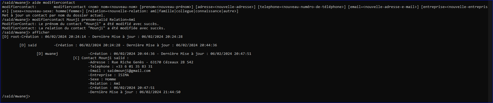

# Gestionnaire des Contacts & Dossiers

## Contexte

Ce projet a été réalisé dans le cadre du cours de développement C#.NET de ZZ2 à l'ISIMA, au sein de la filière F2. Il s'agissait d'un projet individuel réalisé par moi, Said Mounji, visant à développer une application de gestion de contacts et de dossiers structurée sous forme d'arborescence. Cette approche permettait une organisation intuitive et efficace des informations, offrant ainsi une expérience utilisateur optimale.

L'implémentation de ce projet se décompose en 3 sous-projets suivants :

### Serialize

Ce projet propose une implémentation robuste et sécurisée d'une interface de sérialisation de données, qui est basée sur le design pattern Factory. Cette interface offre une flexibilité accrue en permettant aux utilisateurs de choisir entre deux méthodes de sérialisation : binaire (utilisant BinaryFormatter) ou XML (utilisant XMLSerializer). En adoptant ce design pattern, le projet garantit une modularité et une extensibilité optimales, tout en simplifiant la gestion et la maintenance du code.

### Data

Ce projet se concentre sur l'implémentation et l'exposition des structures de données métier essentielles requises pour son fonctionnement. En plus de ces structures, il intègre un gestionnaire d'arborescence, qui inclut la sérialisation des données chiffrées. La sérialisation des données est réalisée sur des objets spécifiques, ce qui permet de sauvegarder uniquement les données nécessaires à la régénération de l'arborescence et de ses informations associées. Cette approche optimise l'utilisation des ressources et réduit la taille des fichiers de sauvegarde, tout en préservant l'intégrité des données.

### Application Console

#### Liste des commandes : `aide`

Description : Capture d'écran montrant la liste des commandes disponibles dans l'application console.

#### Ajouter Dossier : `ajouterdossier <nomDossier>`

Description : Capture d'écran montrant l'ajout d'un dossier dans l'application console.

#### Ajouter Contact : `ajoutercontact <nom> <prenom> <adresse> <telephone> <email> <entreprise> <sexe:Homme|Femme> <relation:Ami|Famille|Collegue|Connaissance|Autre>`

Description : Capture d'écran montrant l'ajout d'un contact dans l'application console.

#### Changement de répertoire : `changerdossier <chemin relatif>`

Description : Capture d'écran montrant le changement de répertoire dans l'application console.

#### Affichage : `afficher`

Description : Capture d'écran montrant l'affichage des dossiers et contacts dans l'application console.

#### Affichage du Chemin Courant : `afficherchemin`

Description : Capture d'écran montrant l'affichage du chemin courant dans l'application console.

#### Suppression du Dossier : `supprimerdossier <nomDossier>`

Description : Capture d'écran montrant la suppression d'un dossier dans l'application console.

#### Suppression du Contact : `supprimercontact <nomContact>`

Description : Capture d'écran montrant la suppression d'un contact dans l'application console.

#### Modification du Dossier : `modifierdossier <nom> nom=<nouveau-nom>`

Description : Capture d'écran montrant la modification d'un dossier dans l'application console.

#### Modification du Contact : `modifiercontact <nom> nom=<nouveau-nom> [prenom=<nouveau-prénom>] [adresse=<nouvelle-adresse>] [telephone=<nouveau-numéro-de-téléphone>] [email=<nouvelle-adresse-e-mail>] [entreprise=<nouvelle-entreprise>] [sexe=<nouveau-sexe: homme|femme>] [relation=<nouvelle-relation: ami|famille|collegue|connaissance|autre>]`

Description : Capture d'écran montrant la modification d'un contact dans l'application console.

#### Enregistrer & Charger : `enregistrer [<cle>]` `charger [<cle>]`

- ##### Sans Clé :

Description : Capture d'écran montrant l'enregistrement et le chargement des données sans clé dans l'application console.

- ##### Avec Clé :

  - ###### 3 Tentatives Échouées :
  
  
  Description : Capture d'écran montrant 3 tentatives échouées d'enregistrement et de chargement des données avec clé dans l'application console.
  
  - ###### Succès :
  
  
  Description : Capture d'écran montrant le succès de l'enregistrement et du chargement des données avec clé dans l'application console.

## Fonctionnalités

- Gestion des dossiers : 
  - Classe Dossier:
    - Attributs : 
      - `Nom` : Nom du dossier 
      - `Fichiers` : liste des fichiers 
    - Méthodes : 
      - `GetFichiers` : retourne la liste des fichiers, sans arguments
      - `AjouterFichier` : ajoute un fichier, arguments (Fichier fichier)
      - `SupprimerFichier` : supprime un fichier, arguments (Fichier fichier)
      - `GetDossiers` : retourne la liste des dossiers, sans arguments
      - `GetDossier` : retourne un dossier, arguments (string path)
      - `SupprimerDossier` : supprime un dossier, arguments (string nom)
      - `GetContact` : retourne un contact, arguments (string nom)
      - `GetContacts` : retourne la liste des contacts, sans arguments
      - `SupprimerContact` : supprime un contact, arguments (string nom)
      - `Clear` : supprime tous les fichiers, sans arguments
      - `GetPath` : retourne le chemin du dossier, sans arguments
      - `GetRoot()` : retourne le dossier racine, sans arguments
      - `ToString(string prefix = "")` : affiche les informations du dossier
      - `ToStorage` : convertit les informations du dossier en fichier de stockage, sans arguments
  - Opérations pour l'application Console :
    - `ajouterdossier <nomDossier>`
    - `modifierdossier <nom> nom=<nouveau-nom>`
    - `supprimerdossier <nomDossier>`
- Gestion des contacts :
  - Classe Contact :
    - Attributs :
      - `Nom` : nom du contact
      - `Prenom` : prénom du contact
      - `Adresse` : adresse du contact
      - `Telephone` : numéro de téléphone du contact
      - `Email` : email du contact
      - `Entreprise` : le nom de l'entreprise du contact
      - `Sexe` : sexe du contact (Homme | Femme)
      - `Relation` : relation de l'utilisateur avec le contact (Ami | Famille | Collegue | Connaissance | Autre)
    - Méthodes :
      - `ToString(string prefix = "")` : pour afficher les informations du contact
      - `ToStorage()` : pour convertir les informations du contact en fichier de stockage
  - Opérations pour l'application Console :
    - `ajoutercontact <nom> <prenom> <adresse> <telephone> <email> <entreprise> <sexe:Homme|Femme> <relation:Ami|Famille|Collegue|Connaissance|Autre>`
    - `modifiercontact <nom> nom=<nouveau-nom> [prenom=<nouveau-prénom>] [adresse=<nouvelle-adresse>] [telephone=<nouveau-numéro-de-téléphone>] [email=<nouvelle-adresse-e-mail>] [entreprise=<nouvelle-entreprise>] [sexe=<nouveau-sexe: homme|femme>] [relation=<nouvelle-relation: ami|famille|collegue|connaissance|autre>]`
    - `supprimercontact <nomContact>`
- Gestion des erreurs et messages d'erreurs utilisateur
- Navigation entre les dossiers et la possibilité d'afficher le répertoire courant ou toute l'arborescence :
  - Navigation : `changerdossier <chemin relatif>`
  - Affichage du répertoire courant : `afficherchemin`
  - Affichage de toute l'arborescence : `afficher`
- Documentation et Qualité du Code
- Sérialisation par deux options (Binary = BinaryFormatter, XML = XmlSerializer) et par un mot de passe, ou identifiant Windows de sécurité (user-SID) si non spécifié :
  
  
- Possibilité d'enregistrer et de charger les données et si une clé de chiffrement a été spécifiée lors de 3 tentatives échouées la suppression de l'enregistrement 
  - Enregistrer : `enregistrer [<cle>]` 
  - Charger : `charger [<cle>]`
